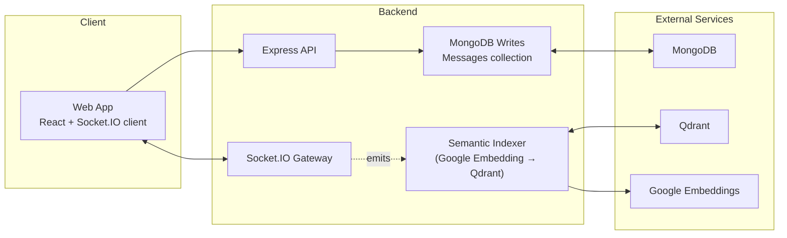

# When the Whole School Shows Up — Bottleneck & Failure Analysis

## System Diagram


## Breaking Point Estimation

- **Server**: GCP e2-standard-2 (2 vCPUs, 8 GB RAM)
- **Traffic**: Each user sends ~1 message/sec on average
- **Per task**: 1 operator and 1 manager (2 users total)
- **DB**: Single Mongo primary with default journaling
- **Sockets**: WebSocket via Socket.IO; payload ~200 bytes per message

Hot-path synchronous cost per message (approx):
- JSON parse/validation: ~0.05 ms
- Mongo write (network + disk): 3–8 ms p50, 10–15 ms p95 (assumed)
- Socket fanout (sender echo + receiver): ~0.1–0.3 ms
- Semantic indexing (embedding + Qdrant) is async (off hot path)

Throughput (single Node process on one core):
- If Mongo write ~8 ms average, theoretical ~125 msgs/sec. Accounting for GC, bursts, framework overhead → sustainable ~80–100 msgs/sec.
- At 1 msg/sec/user → ~80–100 concurrent senders → roughly ~160–200 concurrent users participating before p95 latency rises (>150–250 ms) and queues build.

Memory constraints:
- Socket.IO connection ~50–100 KB/conn (assume 75 KB).
- With ~5.5 GB effectively available for connections → ~73k sockets upper bound.
- Memory is not the first bottleneck; CPU + DB IO will hit limits earlier.

Network constraints:
- ~400 B round-trip per message (two emits). At 1000 msgs/sec ≈ 0.4 MB/s upstream → not a bottleneck here.

**Conclusion**
- Breaking point: ~80–100 msgs/sec per Node process on this VM → ~160–200 concurrent users at 1 msg/sec each.
- Limiting factor: Mongo write latency and single-threaded event loop contention. Secondary: CPU during spikes.

## Reasoning with Estimates

- **Sustainable throughput**: ~80–100 msgs/sec
- **CPU time per msg (userland)**: ~0.2–0.5 ms
- **Mongo write p50/p95**: ~8/15 ms (assumptions)
- **Memory per connection**: ~75 KB (10k sockets ≈ ~750 MB)
- **Async indexing path**: Google embedding ~50–120 ms; Qdrant upsert ~5–20 ms (not on request path)

## Monitoring Plan & Implementation

What to monitor:
- messages_per_sec (throughput)
- active_sockets (load proxy)
- mongo_write_ms (critical path latency)
- process memory (rss/heap)
- [optional] event_loop_lag_ms (saturation)

How to detect in production:
- Emit structured JSON logs to stdout and ship to your logging backend (Cloud Logging / Loki+Grafana / ELK).
- Create dashboards and alerts on the above KPIs.

Implemented logging (already in code):
- In `backend/server.js`, two critical metrics are implemented:
  - Windowed runtime metric every 5s:
    - `{ t, metric: "runtime", messages_per_sec, active_sockets, rss_mb, heap_used_mb }`
  - Per-write Mongo latency:
    - `{ t, metric: "mongo_write_ms", value }`

Optional event-loop lag snippet:
```js
let lagStart = process.hrtime.bigint();
setInterval(() => {
  const now = process.hrtime.bigint();
  const diffMs = Number(now - lagStart) / 1e6 - 1000;
  lagStart = now;
  console.log(JSON.stringify({
    t: new Date().toISOString(),
    metric: "event_loop_lag_ms",
    value: Math.max(0, Number(diffMs.toFixed(2)))
  }));
}, 1000);
```

Dashboards & Alerts (suggested):
- Alert if `messages_per_sec > 80` for >2 min
- Alert if `mongo_write_ms` p95 > 30 ms
- Alert if `event_loop_lag_ms` p95 > 50 ms
- Track `active_sockets`, `rss_mb`, `heap_used_mb`

## Mitigation Plan

Short-term
- Trim payloads; remove verbose logs on hot path.
- Ensure only essential Mongo indexes; use `w:1` if appropriate for latency SLOs.
- Run 2 Node workers (pm2 cluster) to utilize both vCPUs.

Medium-term
- Scale horizontally behind a load balancer; enable sticky sessions for Socket.IO.
- Use Redis adapter for Socket.IO to fan out across instances.
- Upgrade Mongo to a replica set on SSD with higher IOPS.
- Queue semantic indexing (BullMQ) to isolate spikes.

Long-term
- Split realtime gateway from API writer service.
- Batch writes (`insertMany`) and small per-user buffers to smooth bursts.
- Consider storage alternatives or sharding if Mongo remains the bottleneck.

## How to Run

Backend
```bash
cd backend
npm install
npm run dev
```

Frontend
```bash
cd frontend
npm install
npm run dev
```

## Where to See Metrics

- Backend logs include JSON lines with `metric: "runtime"` and `metric: "mongo_write_ms"`.
- Forward to dashboards/alerts.
